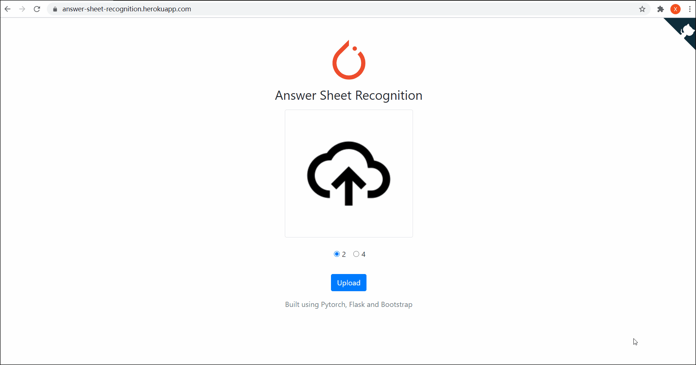

# Answer-Sheet-Recogniton
This repo contains a sample code to show how to identify the 'ABCD' inside the answer sheet using transfer learning based on pytorch and trained on the own marked answer sheet dataset.
## Demo
> [https://answer-sheet-recognition.herokuapp.com/](https://answer-sheet-recognition.herokuapp.com/)


## Install
Install `pytorch` and other necessary module (`tensorboard` and `matplotlib`).
```bash
pip install -r requirements.txt
```
## Train
Run [train.py](train.py) to train your model.
```bash
python train.py
```
## Test
Run [test.py](test.py) to test the trained model.
```bash
python test.py
```
## Deploy
[](https://heroku.com/deploy?template=https://github.com/XavierJiezou/answer-sheet-recognition/tree/deploy)
1. register an account of [heruku](https://www.heroku.com/)
2. create an `app` on heruku
3. push the `deploy` folder to heroku master